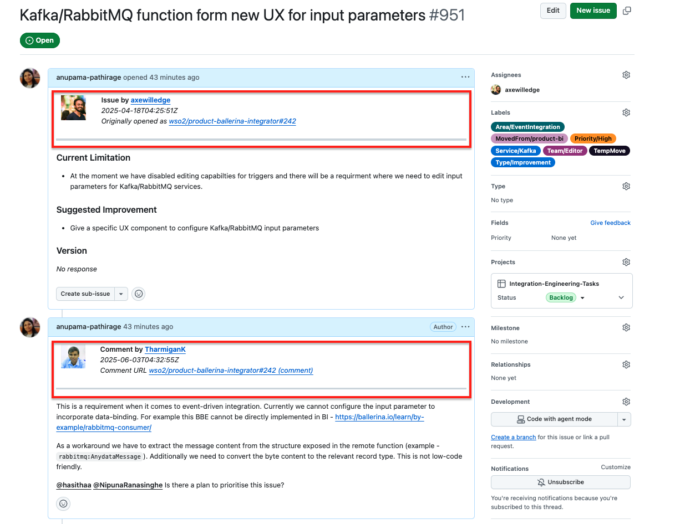

# GitHub Issue Mover

A tool to migrate GitHub issues from one repository to another, preserving labels, comments, assignees, and original author attribution.

## Prerequisites

- [Ballerina](https://ballerina.io/downloads/) 2201.13.1 or later
- A GitHub [Personal Access Token (PAT)](https://github.com/settings/tokens) with `repo` scope for both the source and target repositories

## Setup

Create a `Config.toml` file in the project root:

```toml
githubToken = "ghp_your_personal_access_token"
sourceRepo = "owner/repo"
targetRepo = "owner/repo"
closeSourceIssue = false
addTargetLabels = "LabelInTargetRepo"
addSourceLabels = "LabelInSourceRepo"
```

| Field | Description |
|-------|-------------|
| `githubToken` | GitHub PAT with `repo` scope |
| `sourceRepo` | Source repository in `owner/repo` format |
| `targetRepo` | Destination repository in `owner/repo` format |
| `closeSourceIssue` | Set to `true` to close source issues after import |
| `addTargetLabels` | Comma-separated labels to add to issues in the target repo (e.g. `"migrated,imported"`) |
| `addSourceLabels` | Comma-separated labels to add to issues in the source repo (e.g. `"moved"`) |

## Usage

**Import all open issues:**
```bash
bal run -- all
```

**Import specific issues by number:**
```bash
bal run -- 123 456 789
```

**Import all issues with a specific label:**
```bash
bal run -- label=bug
```

## Example



## What gets migrated

- Issue title and body
- Labels (missing labels are auto-created in the target repo with the same color and description)
- Comments (re-posted with original author attribution — avatar, username, timestamp, and link to original comment)
- Assignees
- Pull requests are automatically excluded when importing all issues

## Notes

- Only **open** issues are fetched when using `all` or `label=` modes
- Comments cannot be posted as the original author due to GitHub API limitations. Instead, each comment is prefixed with a header crediting the original author
- Imports up to 100 issues per run when using `all` or `label=` modes
